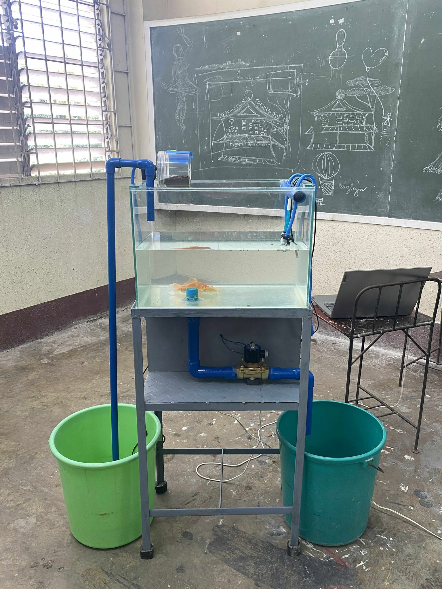
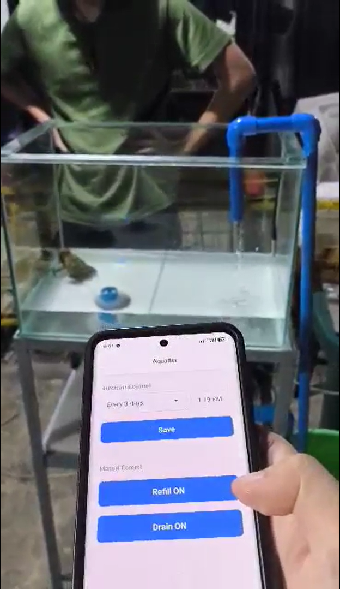
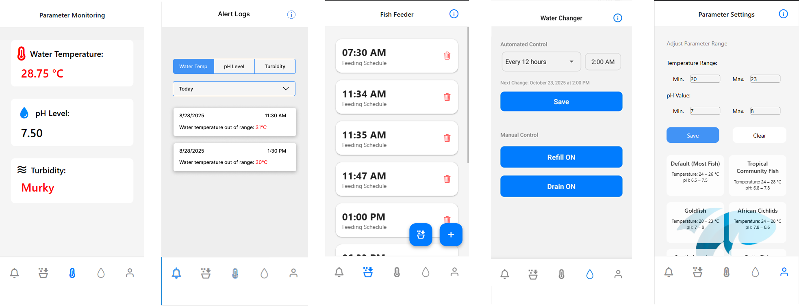

# 🐟 Smart Aquatic Steward
### An Automated Management and Water Monitoring System for Fish Tanks


-00599C?logo=c)


Smart Aquatic Steward is an IoT-based fish tank management system that automates water monitoring, water changes, and feeding schedules. It combines hardware sensors, an ESP32 microcontroller, and a React Native mobile application to give fish keepers real-time visibility and control over their aquatic environment.

<p align="center">
  
  &nbsp;&nbsp;&nbsp;
  
</p>

---

## 📋 Table of Contents

- [Problem Statement](#-problem-statement)
- [Objectives](#-objectives)
- [Features](#-features)
- [System Architecture](#-system-architecture)
- [Tech Stack](#-tech-stack)
- [Hardware Components](#-hardware-components)
- [Mobile Application](#-mobile-application)
- [Getting Started](#-getting-started)
- [ESP32 Firmware Setup](#-esp32-firmware-setup)
- [Firebase Configuration](#-firebase-configuration)
- [SMS Notification Setup](#-sms-notification-setup)
- [Contributing](#-contributing)
- [License](#-license)

---

## ❗ Problem Statement

Fish keeping presents several recurring challenges that this system aims to solve:

1. **Lack of monitoring tools** — Fish keepers have no easy way to continuously monitor critical water parameters such as pH level, temperature, and turbidity.
2. **Time-consuming manual water changes** — Owners must manually remove and replace water, which is labor-intensive and often done inconsistently.
3. **Inconsistent feeding schedules** — Managing timely feeding is prone to human error, especially when the owner is unavailable.
4. **No real-time water quality tracking** — Without continuous monitoring, critical changes in water quality can go undetected until it is too late.

---

## 🎯 Objectives

1. Design and implement a sensor-based system to continuously monitor key water parameters — pH level, temperature, and turbidity.
2. Implement an automated water-changing system that allows users to remotely control water changes via the mobile app.
3. Develop an automated feeding mechanism that dispenses food on a set, reliable schedule.
4. Build a mobile application that displays real-time sensor data and provides continuous tracking of water quality parameters with SMS alerts for critical conditions.

---

## ✨ Features

- **Real-time water monitoring** — Live readings of pH, temperature, and turbidity streamed from the ESP32 to the mobile app via Firebase.
- **Automated water changes** — Remotely trigger or schedule water changes directly from the app.
- **Automated feeding** — Set feeding schedules that the system executes reliably regardless of owner availability.
- **SMS notifications** — Receive instant SMS alerts via iProgSMS when water parameters fall outside safe ranges.
- **Historical tracking** — View trends and logs of water quality data over time.
- **Android mobile app** — Built with React Native for Android devices.

### 📸 App Screenshots

<p align="center">
  
</p>

The application consists of five main screens, each accessible via the bottom navigation bar:

| Screen | Description |
|---|---|
| **Parameter Monitoring** | The home dashboard displaying real-time sensor readings — water temperature (°C), pH level, and turbidity status. Each parameter is presented with a clear icon and color-coded value for quick assessment of tank health. |
| **Alert Logs** | A chronological log of all triggered alerts. Users can filter by parameter type (Water Temp, pH Level, Turbidity) and date. Each entry shows the timestamp and the exact out-of-range reading that triggered the alert. |
| **Fish Feeder** | Manages automated feeding schedules. Displays all scheduled feeding times in a scrollable list with delete options. Users can add new schedules using the "+" button or manually trigger a feeding session. |
| **Water Changer** | Controls the automated water change system. Provides both automated scheduling (configurable interval and time) and manual controls with "Refill ON" and "Drain ON" buttons for on-demand water changes. |
| **Parameter Settings** | Allows users to configure safe parameter ranges for temperature and pH. Includes preset profiles for common fish types (Default, Tropical Community Fish, Goldfish, African Cichlids) for quick configuration. |

---

## 🏗 System Architecture

```
┌─────────────────────────────────────┐
│          Mobile Application          │
│        (React Native + TypeScript)   │
└────────────────┬────────────────────┘
                 │ Real-time sync
                 ▼
┌─────────────────────────────────────┐
│             Firebase                 │
│    (Realtime Database + Auth)        │
└────────────────┬────────────────────┘
                 │ Read/Write
                 ▼
┌─────────────────────────────────────┐
│           ESP32 Firmware             │
│          (Written in C)              │
├─────────────────────────────────────┤
│  pH Sensor │ Temp Sensor │ Turbidity │
│  Water Pump │ Feeder Motor           │
└─────────────────────────────────────┘
                 │ SMS Alerts
                 ▼
┌─────────────────────────────────────┐
│         iProgSMS API                 │
│    (SMS Notification Service)        │
└─────────────────────────────────────┘
```

---

## 🛠 Tech Stack

| Layer | Technology |
|---|---|
| Mobile App | React Native (TypeScript) |
| Database | Firebase Realtime Database |
| Authentication | Firebase Auth |
| Microcontroller | ESP32 |
| Firmware Language | C |
| SMS Notifications | iProgSMS API |

---

## 🔧 Hardware Components

| Component | Purpose |
|---|---|
| ESP32 Microcontroller | Central processing unit for sensors and actuators |
| pH Sensor | Measures acidity/alkalinity of the water |
| Water Temperature Sensor | Monitors water temperature in real time |
| Turbidity Sensor | Detects water clarity and cloudiness |
| Water Pump / Solenoid Valve | Automates water change operations |
| Servo / Stepper Motor | Drives the automated fish feeder |
| Power Supply | Powers the ESP32 and connected components |

---

## 📱 Mobile Application

The mobile app is built with **React Native** and **TypeScript**, providing a clean dashboard for monitoring and control.

### Key Screens

- **Dashboard** — Live sensor readings (pH, temperature, turbidity) with status indicators
- **Alerts** — History of triggered notifications and critical events
- **Feeding Schedule** — Set, edit, and manage automated feeding times
- **Water Change** — Manually trigger or schedule automated water changes
- **Settings** — Configure alert thresholds and SMS notification preferences

---

## 🚀 Getting Started

### Prerequisites

- Node.js v18 or higher
- Expo CLI
- Android Studio or Xcode (for emulator/device testing)
- Firebase account
- iProgSMS account
- Arduino IDE (for ESP32 firmware)

### Mobile App Setup

```bash
# Clone the repository
git clone https://github.com/your-username/smart-aquatic-steward.git
cd smart-aquatic-steward

# Install dependencies
npm install

# Start Expo development server
npx expo start

# Run on Android
npx expo run:android

# Run on iOS
npx expo run:ios
```

---

## 🔌 ESP32 Firmware Setup

1. Open the `firmware/` folder in **Arduino IDE**.
2. Install the following libraries via the Arduino Library Manager:
   - `Firebase ESP32 Client` by Mobizt
   - `OneWire`
   - `DallasTemperature`
3. Open `firmware/main.c` and update the following constants:

```c
#define WIFI_SSID       "your_wifi_ssid"
#define WIFI_PASSWORD   "your_wifi_password"
#define FIREBASE_HOST   "your-project.firebaseio.com"
#define FIREBASE_AUTH   "your_firebase_database_secret"
```

4. Select your ESP32 board under **Tools > Board > ESP32 Dev Module**.
5. Upload the firmware to your ESP32.

---

## 🔥 Firebase Configuration

1. Go to the [Firebase Console](https://console.firebase.google.com/) and create a new project.
2. Enable **Realtime Database** and set rules to authenticated access.
3. Enable **Firebase Authentication** (email/password).
4. Download `google-services.json` (Android) or `GoogleService-Info.plist` (iOS) and place them in the appropriate directories:

```
android/app/google-services.json
ios/GoogleService-Info.plist
```

5. Create a `.env` file in the project root:

```env
FIREBASE_API_KEY=your_api_key
FIREBASE_AUTH_DOMAIN=your_project.firebaseapp.com
FIREBASE_DATABASE_URL=https://your_project.firebaseio.com
FIREBASE_PROJECT_ID=your_project_id
FIREBASE_STORAGE_BUCKET=your_project.appspot.com
FIREBASE_MESSAGING_SENDER_ID=your_sender_id
FIREBASE_APP_ID=your_app_id
```

---

## 📲 SMS Notification Setup

This project uses [iProgSMS](https://www.iprogsms.com/) for SMS alerts when water parameters go out of range.

1. Register an account at [iprogsms.com](https://www.iprogsms.com/).
2. Obtain your API key from the dashboard.
3. Add the following to your `.env` file:

```env
IPROGSMS_API_KEY=your_api_key
IPROGSMS_SENDER_ID=your_sender_name
ALERT_PHONE_NUMBER=+639XXXXXXXXX
```

4. SMS alerts are triggered automatically when:
   - pH drops below or exceeds the configured safe range
   - Water temperature reaches a critical threshold
   - Turbidity indicates dangerously cloudy water

---

## 🤝 Contributing

Contributions are welcome. To contribute:

1. Fork the repository
2. Create a feature branch (`git checkout -b feature/your-feature`)
3. Commit your changes (`git commit -m 'Add your feature'`)
4. Push to the branch (`git push origin feature/your-feature`)
5. Open a Pull Request

---

## 📄 License

This project is licensed under the MIT License. See the [LICENSE](LICENSE) file for details.

---

> Built by [Joshua Ian Cadiz](https://github.com/joshiancadiz) — Front-End Software Engineer
